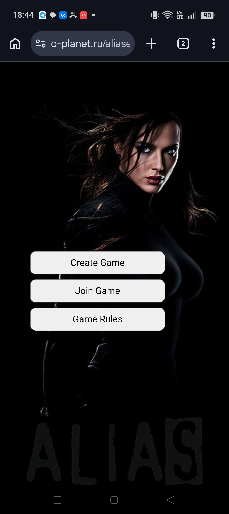
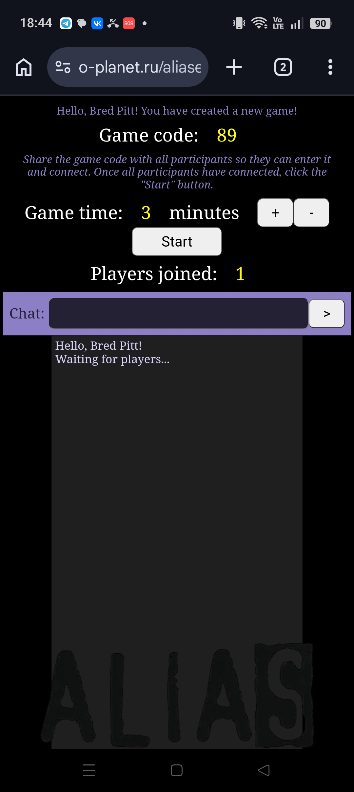
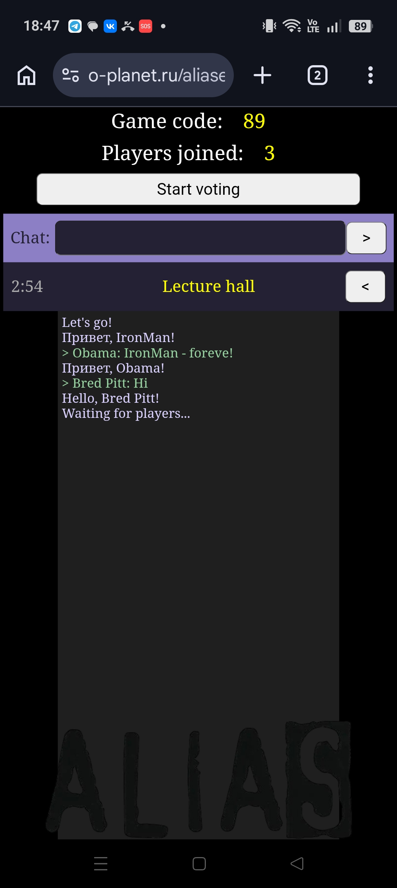
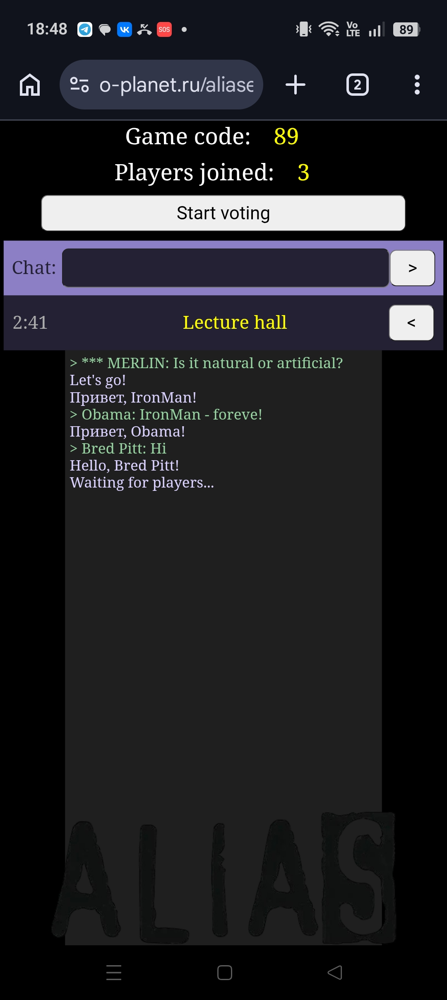
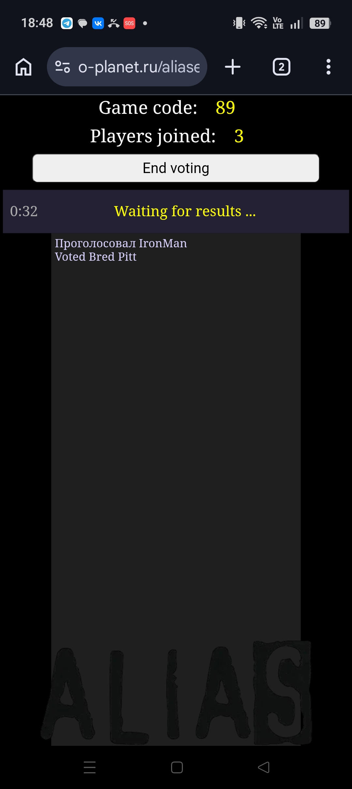
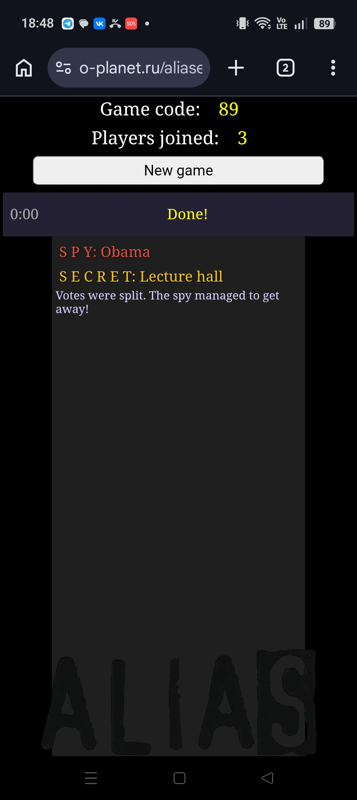
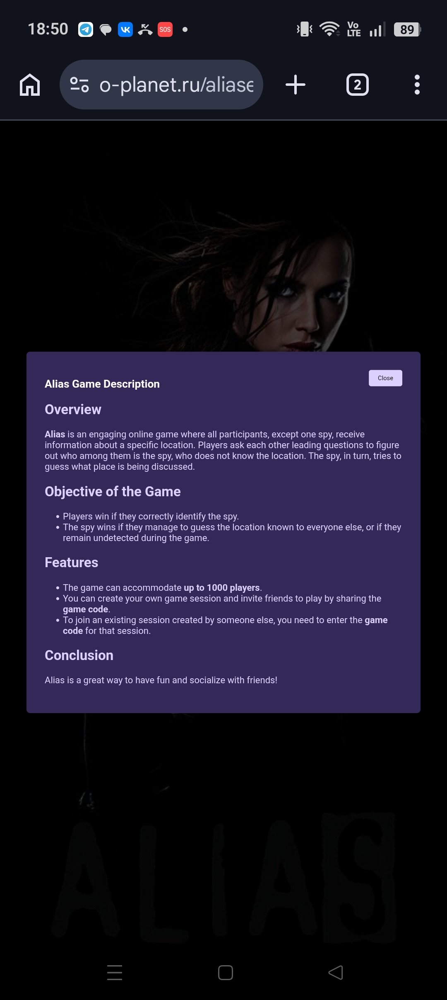

<div align="center">

###### 🌐 Language / Язык

[🇷🇺 Русский](README.ru.md) &nbsp;|&nbsp; [🇬🇧 English](README.md)

</div>

---

# 🕵️ Alias (Шпион) — Онлайн-игра для компании

🌐 **Демо-версия:** http://www.o-planet.ru/alias/

📋 Описание
Alias — это увлекательная онлайн-игра в шпионов, идеальная для вечеринок и онлайн-встреч с друзьями. Все участники, кроме одного, получают секретную информацию о конкретном месте (локации). Один случайно выбранный игрок становится шпионом, который не знает, где находится.

Игроки по очереди задают друг другу наводящие вопросы, связанные с этим местом, пытаясь выяснить, кто среди них чужак. Шпион должен внимательно слушать ответы и догадываться о локации, не выдавая себя. В конце раунда проходит голосование — команда пытается поймать шпиона, а шпион пытается угадать место.

> 💡 **О проекте:** Эта игра создана для демонстрации и популяризации PHP-фреймворка **LOTIS**. 
> 🔗 Фреймворк: https://github.com/O-Planet/LOTIS

## 📸 Скриншоты
<div align="center">
  
  
  
  <br/>
  
  
  
  <br/>
  
</div>

*Скриншоты мобильной версии игры*

## 🎯 Цели игры
- **Для обычных игроков:** Вычислить шпиона по его подозрительным ответам и поведению
- **Для шпиона:** Либо остаться нераскрытым, либо правильно угадать место, о котором говорят другие

## ✨ Особенности
- Поддержка до 1000 игроков в одной игре
- Простое подключение по коду игры — создай сессию и пригласи друзей
- Автоматический выбор шпиона и локации
- Встроенный чат для общения
- Система голосования с таймером
- База из сотен разнообразных локаций (от пляжа до космодрома)
- "Мерлин" — виртуальный помощник, задающий наводящие вопросы

## 🚀 Установка

### Требования
- PHP 5.7 или выше
- MySQL / MariaDB
- Веб-сервер (Apache/Nginx)
- Фреймворк LOTOS

### Пошаговая инструкция

#### 1. Клонирование репозитория
```bash
git clone [repository-url]
# или скачайте архив и распакуйте
```

Структура проекта должна быть следующей:
```
src/
├── newlotis/          # Фреймворк LOTOS
└── alias/             # Файлы игры (этот репозиторий)
```

#### 2. Настройка подключения к БД
Откройте файл `connect.php` и укажите параметры вашей базы данных:

```php
<?php
$databasename = 'alias';        // Имя базы данных
$databaseserver = 'localhost';  // Адрес сервера
$databaseuser = 'root';         // Пользователь MySQL
$databasepassword = 'root';     // Пароль
?>
```

#### 3. Создание таблиц
Откройте в браузере следующий URL для автоматического создания структуры базы данных:
```
http://ваш-сайт/alias/sdb.php?updatereg=create
```

**Готово!** Игра установлена и готова к работе.

## 🎮 Как играть

1. **Создание игры:** Администратор создаёт игру и получает уникальный код
2. **Подключение:** Игроки вводят код и своё имя для входа
3. **Старт:** После подключения минимум 3 игроков админ запускает игру
4. **Процесс:**
   - Всем, кроме шпиона, показывается секретная локация
   - Игроки задают друг другу вопросы («Там можно купить кофе?»)
   - Шпион отвечает, не зная локации, но стараясь не выдать себя
5. **Голосование:** По истечении времени все голосуют, кто шпион
6. **Итоги:** Побеждает команда (если поймала шпиона) или шпион (если угадал место или остался незамеченным)

## 🛠 Технические детали

- **Язык:** PHP (фреймворк LOTOS)
- **База данных:** MySQL
- **Frontend:** HTML5, CSS3, JavaScript (jQuery)
- **Файлы данных:**
  - `secrets.d` — список локаций
  - `vopr.d` — база вопросов от Мерлина
  - `spy.d` — шуточные советы шпионам

## 📄 Лицензия

Проект открыт для свободного использования.

## 🔗 Ссылки

- 🎮 **Играть онлайн:** http://www.o-planet.ru/alias/
- 🛠 **Фреймворк LOTIS:** https://github.com/O-Planet/LOTIS


